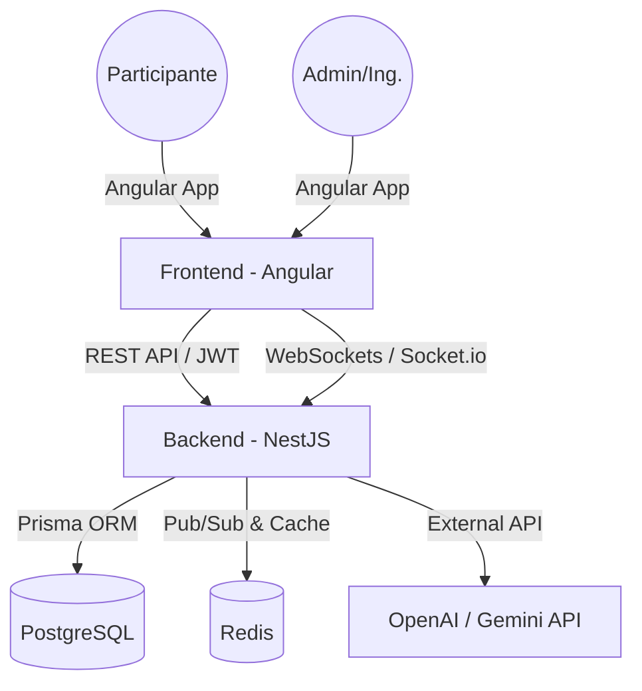
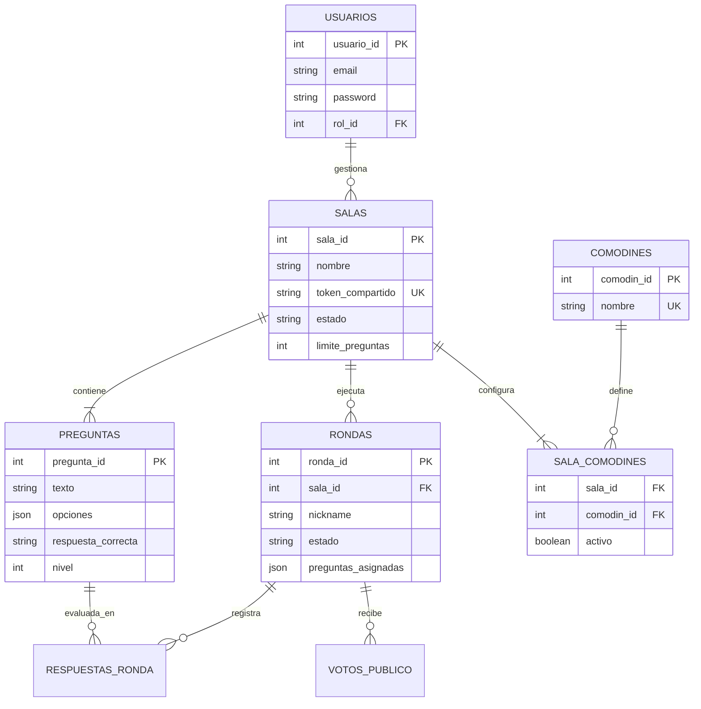
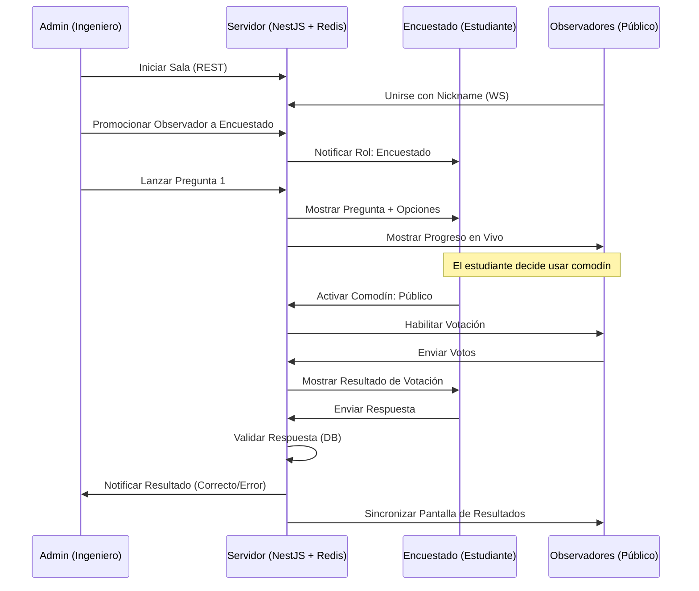

# Arquitectura del Sistema — Quizis

Este documento describe la arquitectura técnica, el modelo de datos y el flujo de interacción de la plataforma **Quizis**, inspirada en "¿Quién quiere ser millonario?".

## 1. Visión General de la Arquitectura

El sistema sigue una arquitectura de **Monorepo** con una clara separación entre el Frontend (Angular) y el Backend (NestJS). La comunicación es híbrida: REST para gestión administrativa y WebSockets para la experiencia de juego en tiempo real.

---

## 2. Modelo de Datos (ER)

El esquema de base de datos está normalizado para soportar múltiples salas, bancos de preguntas extensos y el historial detallado de cada ronda de juego.

---

## 3. Flujo de Partida (Tiempo Real)

El flujo de juego depende de eventos sincronizados vía WebSockets. Redis actúa como el motor de estado para asegurar que todos los observadores vean lo mismo que el encuestado.

---

## 4. Estrategia de Comodines (Lifelines)

Los comodines están desacoplados de la sala mediante un catálogo centralizado. Esto permite extender el juego fácilmente.

| Comodín | Implementación Técnica |
|---|---|
| **🗳️ Público** | WS Event `audience:vote` -> Redis Aggregation -> WS Emit `audience:result`. |
| **🤖 IA** | Backend Service -> LLM API -> Prompt dinámico con contexto de pregunta -> Sugerencia. |
| **📞 Llamada** | WS Event `call:request` -> Target UI Notification -> Participant Input -> WS Emit. |

---

## 5. Seguridad y Acceso

1.  **Administradores:** Autenticación estricta vía **JWT** (Access + Refresh Tokens). Solo ellos pueden realizar acciones destructivas o de configuración.
2.  **Participantes:** Acceso por **Token de Sala** (UUID no predecible). No requieren cuenta. Su identidad es volátil (nickname + Socket ID) pero sus resultados se persisten para el historial.
3.  **Estado Stateless:** El servidor no guarda el estado de la partida en memoria local; todo se coordina a través de **Redis**, permitiendo escalar el backend horizontalmente.
