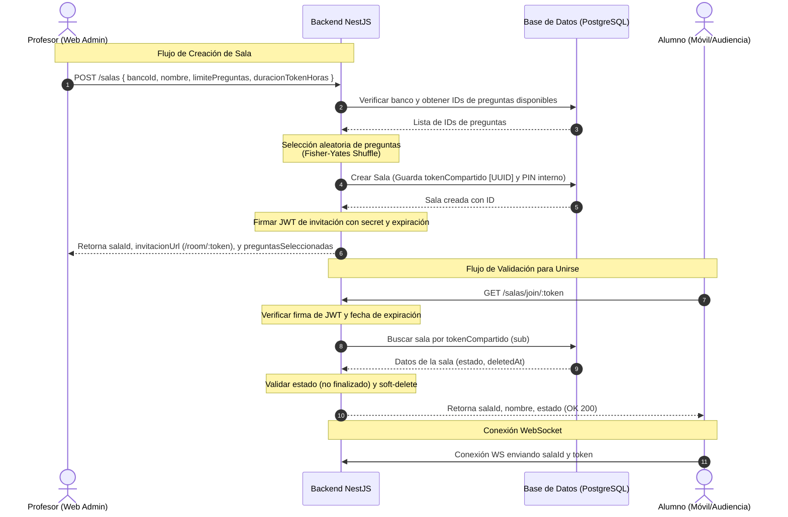

# Flujo de Funcionamiento: Salas con JWT y Selección de Preguntas

Este documento describe la arquitectura y el flujo de comunicación para la creación de salas de juego, la selección aleatoria de preguntas y la validación de acceso de participantes (audiencia móvil) mediante tokens JWT criptográficos, reemplazando el sistema anterior de PIN manual de 4 dígitos.

---

## Arquitectura del Sistema



---

## 1. Flujo de Creación de Sala (Profesor / Administrador)

Este flujo se ejecuta cuando un profesor inicia una nueva sesión de juego desde el panel web de administración.

### Endpoint: `POST /salas`
* **Acceso**: Protegido (Requiere cabecera `Authorization: Bearer <admin_token>` y permiso `create` en salas).
* **DTO de Entrada (`CreateSalaDto`)**:
  ```json
  {
    "bancoId": 1,
    "nombre": "Examen de Calidad de Software",
    "limitePreguntas": 10,        // Opcional (Default: 15)
    "duracionTokenHoras": 2       // Opcional (Default: configurable en .env)
  }
  ```

### Pasos en el Backend (`CreateSalaUseCase`):
1. **Verificación de Banco**: Valida la existencia del banco en la base de datos.
2. **Selección Aleatoria de Preguntas**:
   - Obtiene todos los IDs de preguntas activas asociadas al banco (`deletedAt: null`).
   - Aplica el algoritmo **Fisher-Yates Shuffle** en memoria para mezclar la lista de manera uniforme y eficiente.
   - Extrae el número de preguntas indicado en `limitePreguntas`.
3. **Persistencia de la Sala**:
   - Genera de forma segura un UUID v4 que servirá como `tokenCompartido` (identificador criptográfico).
   - Genera un código PIN secundario para compatibilidad de base de datos (`ROOM-XXXX-123`).
   - Guarda la sala en la tabla `salas`.
4. **Firma del JWT de Invitación**:
   - Utiliza la clave `JWT_ROOM_SECRET`.
   - Si `duracionTokenHoras` no fue enviado en el DTO, se extrae el valor predeterminado `JWT_ROOM_EXPIRES_IN` del archivo `.env` (ej. `24h`).
   - El payload del JWT resultante contiene:
     ```json
     {
       "sub": "UUID_de_tokenCompartido",
       "salaId": 12,
       "tipo": "room_invite"
     }
     ```
5. **Retorno de Datos**:
   El backend responde al profesor con los datos públicos de la sala, las preguntas asignadas y el enlace:
   ```json
   {
     "salaId": 12,
     "nombre": "Examen de Calidad de Software",
     "estado": "BORRADOR",
     "tokenInvitacion": "eyJhbGciOi...",
     "tokenExpiraEn": "2026-05-25T19:14:32.000Z",
     "invitacionUrl": "/room/eyJhbGciOi...",
     "preguntasSeleccionadas": [101, 105, 112, 108, 102, 115, 120, 103, 109, 114]
   }
   ```

---

## 2. Flujo de Validación e Ingreso (Participante / Audiencia)

Este flujo se ejecuta cuando un alumno escanea un código QR o hace clic en un enlace de invitación para unirse a la partida desde su dispositivo móvil.

### Endpoint: `GET /salas/join/:token`
* **Acceso**: Público (Sin autenticación).
* **Parámetro**: `:token` (Token JWT extraído del enlace `/room/:token`).

### Pasos en el Backend (`ValidateTokenSalaUseCase`):
1. **Validación Criptográfica (JWT)**:
   - El backend intenta decodificar y validar la firma digital y la expiración temporal del token JWT usando `JWT_ROOM_SECRET`.
   - Si la firma no coincide o el tiempo de expiración superó el límite (por ejemplo, pasaron las 24 horas predeterminadas), se lanza inmediatamente un `BadRequestException` (`400: El token de invitación es inválido o ha expirado`).
2. **Validación de Tipo**:
   - Se verifica que el claim `tipo` sea exactamente `'room_invite'` para evitar el uso de tokens de acceso de administración.
3. **Lookup en Base de Datos**:
   - Se realiza una búsqueda por el campo `tokenCompartido` utilizando el valor `sub` extraído del JWT.
   - Si la sala no existe o posee la bandera `deletedAt` activa (soft-delete), se retorna un `NotFoundException` (`404`).
4. **Validación del Estado**:
   - Se comprueba el estado actual de la sala. Si la sala está en estado `FINALIZADO`, se lanza un `BadRequestException` (`400: La sala ha finalizado y ya no acepta participantes`).
5. **Retorno de Datos**:
   Si todo es correcto, se responde con éxito (`200 OK`) entregando los datos para que el cliente móvil configure la pantalla de espera de la sala y proceda a abrir la conexión por sockets:
   ```json
   {
     "salaId": 12,
     "nombre": "Examen de Calidad de Software",
     "estado": "ESPERANDO_ALUMNOS",
     "limitePreguntas": 10
   }
   ```

---

## Variables de Entorno Requeridas (`.env`)

Para el correcto funcionamiento de este flujo, el archivo `.env` del backend debe tener las siguientes configuraciones:

```env
# Secreto para firmar criptográficamente los tokens JWT de invitación a salas
JWT_ROOM_SECRET=generate_a_strong_secret_for_room_invitation_tokens

# Duración predeterminada si no se indica en el endpoint (ej: 24h, 12h, 7d)
JWT_ROOM_EXPIRES_IN=24h
```
